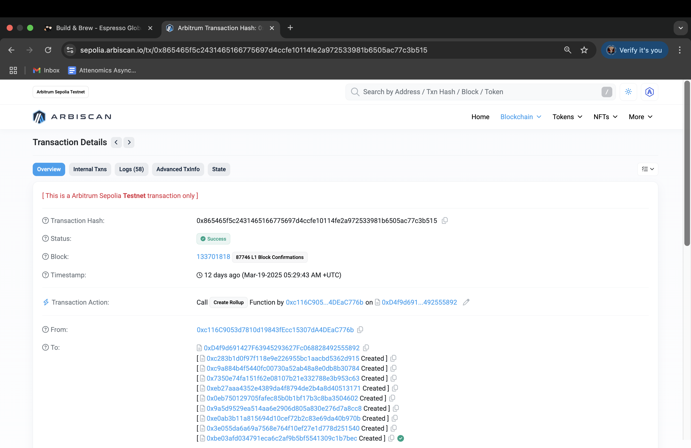
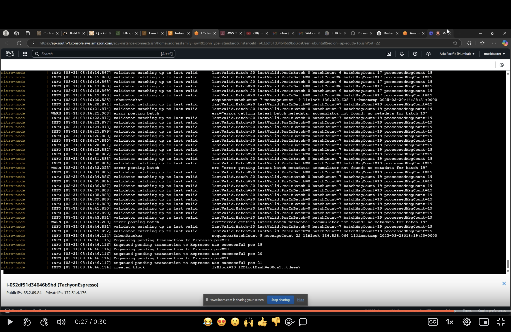
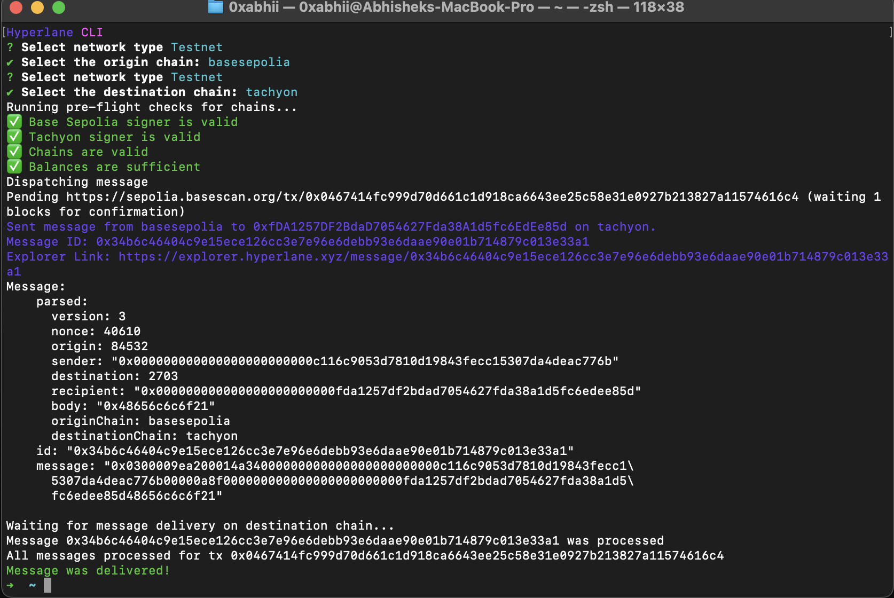

# Tachyon Chain Rollup by Espresso

## Local Dev

```
$ docker compose up
```

## Rollup liveness verification

### CreateRollup transaction hash : `0x865465f5c2431465166775697d4ccfe10114fe2a972533981b6505ac77c3b515`



### IP address of your Cloud Server (e.g., your EC2 instance on AWS): ```curl -X POST http://65.2.69.84:8547 -H "Content-Type: application/json" --data '{"jsonrpc":"2.0","method":"eth_chainId","params":[],"id":1}'```



### Chain ID / Namespace of the deployed rollup : `2703` or `0xa8f`(in hex)

### Tachyon Network Details

| Parameter               | Value                     |
|-------------------------|--------------------------|
| **Name**               | tachyon                  |
| **Display Name**       | Tachyon                  |
| **Chain ID**           | 2703                     |
| **Domain ID**          | 2703                     |
| **Protocol**           | Ethereum                 |
| **JSON RPC URL**       | `http://65.2.69.84:8547` |
| **Native Token Symbol** | ETH                      |
| **Native Token Name**  | Ether                    |
| **Native Token Decimals** | 18                     |


## Testing the Chain Locally

To verify that chain is running correctly:

Check Confirmed Nodes by the Validator/Staker

```
cast call --rpc-url https://arbitrum-sepolia-rpc.publicnode.com 0xc9A884B4F5440fc00730A52ab48a8e0Db8b30784 "latestConfirmed()(uint256)"
```

Test bridge functionality:

```
cast send --rpc-url https://arbitrum-sepolia-rpc.publicnode.com 0x0EB750129705fAfec85B0b1BF17B3c8bA3504602 'depositEth() external payable returns (uint256)' --private-key $YOUR_PRIVATE_KEY  --value 10000000000 -vvvv
```
Note: Bridging transactions can take up to 15 minutes to finalize.

Verify your balance:

```
cast balance $YOUR_PUBLIC_ADDRESS --rpc-url http://65.2.69.84:8547
```

Test sending transactions:

```
cast send $ANY_ADDRESS --value 1 --private-key $YOUR_PRIVATE_KEY --rpc-url http://65.2.69.84:8547
```

For a more consistent test, you can also continuously send transactions to the rollup. This approach simulates a more realistic environment by continually submitting transactions, allowing you to see how the system handles ongoing activity. (See the next section for details.)

Check recipient balance:

```
cast balance $ANY_ADDRESS --rpc-url http://65.2.69.84:8547
```

If successful, the recipient's balance should show 1 wei or the amount you sent if different.

## Hyperlane integration

✅ Tachyon Core contract deployments complete on Hyperlane:

    staticMerkleRootMultisigIsmFactory: "0x7d51B541B044FFD20926F9634924d029E29906BC"
    staticMessageIdMultisigIsmFactory: "0x63c647E63838f3aE337EDf0fa2Ded1B322C86A99"
    staticAggregationIsmFactory: "0x784A9C7e42CD6456aE4E3C722C43d89E419fEFBc"
    staticAggregationHookFactory: "0xAfb6e64c3055D020804646c3BB1F801dA6a5bABe"
    domainRoutingIsmFactory: "0xE5D933EFfc0b0611d723E1ED421AEc7AfAEe2975"
    staticMerkleRootWeightedMultisigIsmFactory: "0x48cf6d92B7b48a1121F3A0338C41cBEac8324443"
    staticMessageIdWeightedMultisigIsmFactory: "0x8a014c0d1020139fa3C9AF04705061CB9b1Bfd48"
    proxyAdmin: "0x7e2e47D388B1d4525Eb8E408521ED8c45E6FcED8"
    mailbox: "0xe86751188603ed0a9E6394aF9aabeDB7166ce49b"
    interchainAccountRouter: "0x28ca0c8C5721a6C3B88cD6834EC4fB32692B70B5"
    interchainAccountIsm: "0xA3CD0Cd546DAD0Ed80fc7DF229a15fd4c9676817"
    validatorAnnounce: "0x328EeE0Ac784c0C7522AfB36e899488b1BC78CFB"
    testRecipient: "0xfDA1257DF2BdaD7054627Fda38A1d5fc6EdEe85d"
    merkleTreeHook: "0x53c8d3484DfCb90d1730aB314c2DE333540a4941"

[Watch the demo of Message relayed though Hyperlane](assets/Relayer.webm)

